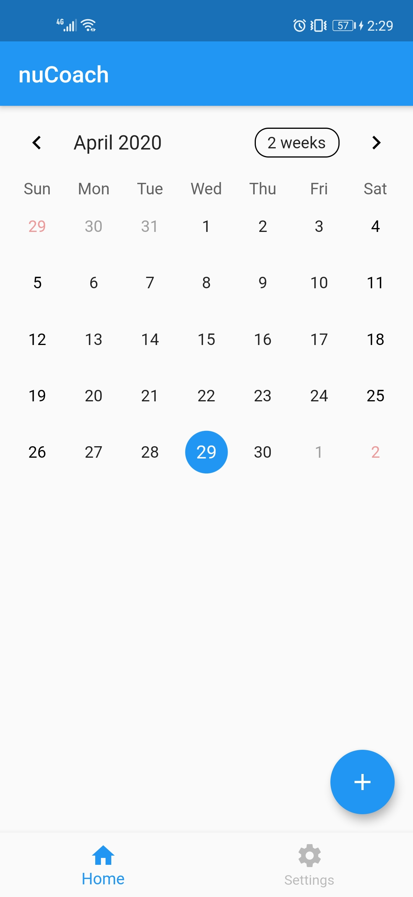
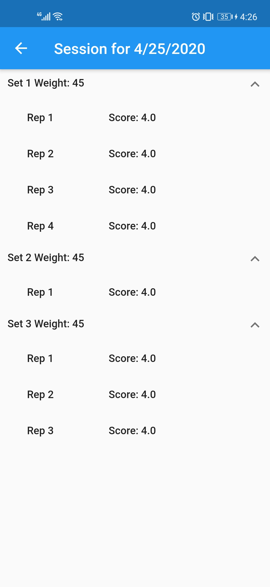
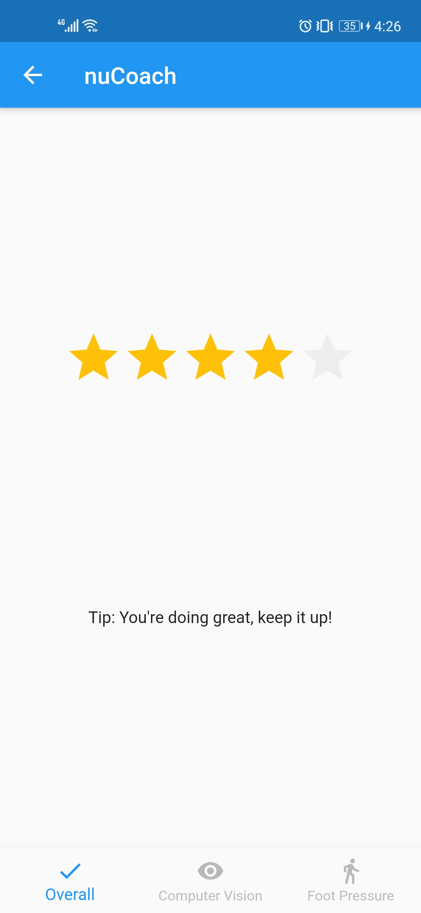
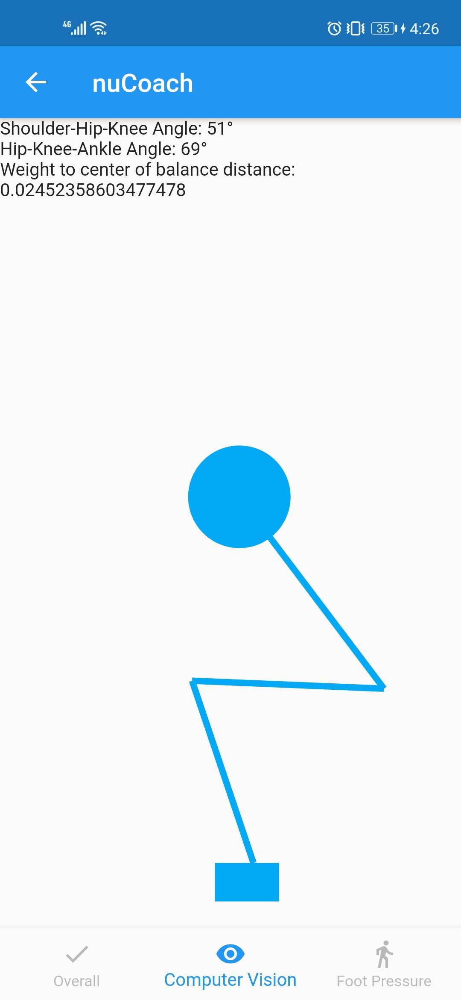
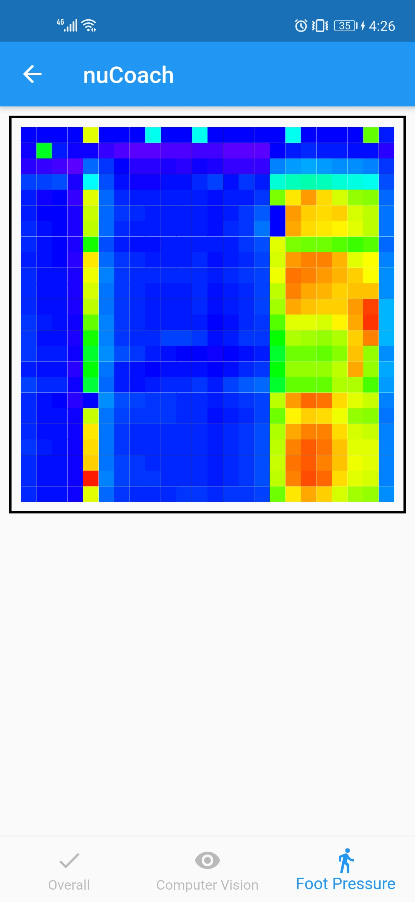

# nuCoach: A Real-Time Exercise Form Monitoring System

nuCoach is a mobile application integrated with a pressure-sensitive mat that allows users to monitor their squatting form. Using computer vision, nuCoach can visually analyze your shoulder-hip-knee and hip-knee-ankle angles and your center of balance. The pressure-sensitive mat captures your weight distribution across your feet as a heatmap so you can see if you’re leaning too far forward or backward. Your reps are analyzed in real-time and are available for review through the mobile application.

To see nuCoach in action, see the video below.

[](https://vimeo.com/412734268 "nuCoach: A Real-Time Exercise Form Monitoring System - Click to Watch!")
<p><a href="https://vimeo.com/412734268">nuCoach: A Real-Time Exercise Form Monitoring System</a> from <a href="https://vimeo.com/utece">UT ECE</a> on <a href="https://vimeo.com">Vimeo</a>.</p>

To learn more about nuCoach's implementation, see our [presentation](https://docs.google.com/presentation/d/1ECtIt3qydr45NIeK_fzGUUQA_OOz4YHEB23BXS4QV_0/edit?usp=sharing).

## Installation
These instructions will help you get the project running on your own machine.

nuCoach is composed of three subsystems:
1. Computer vision
2. Foot pressure
3. Mobile application

The computer vision subsystem resides within the mobile application code. The foot pressure subsystem is composed of a hardware component and Arduino code.

**Computer Vision and Mobile Application**
* Install [Flutter](https://flutter.dev/docs/get-started/install) for your operating system

**Foot Pressure**
* Install the [Arduino IDE](https://www.arduino.cc/en/main/software) or use their web editor
* Obtain an [Arduino Uno Rev3](https://store.arduino.cc/usa/arduino-uno-rev3)

It is important to note that the Bluetooth functionality for the foot pressure subsystem only works with Android due to the use of Bluetooth serial instead of Bluetooth Low Energy. Additionally, people looking to recreate our work would need to build the pressure-sensitive mat we used.

## Understanding the Code

### File Structure
The main folder you will be working in is the `lib` directory. That is where all of the Flutter code resides. The `android` and `ios` directories are generated by Flutter and contains native Android and iOS code. The `arduino` directory holds all code used to interface between the Arduino and the phone as well as scripts for testing the Arduino with a computer. The `assets` directory contains the model used by the computer vision subsystem. The `test` folder contains a sample test for the default Flutter app. `pubspec.yaml` contains the packages and dependencies used in the project. The `img` folder contains the screenshots and gifs used throughout this README.md

```
nuCoach
├── android
├── arduino
├── assets
├── img
├── ios
├── lib
├── test
├── README.md
└── pubspec.yaml
```
The `lib` directory contains all of the Flutter code. The `bluetooth` directory contains all of the code that enables Bluetooth functionality for the application and collects the data from the Arduino. The `components` directory isn't significant. The `database` directory contains everything related to interacting with the database. The `enums` folder isn't significant, but could be useful in extending the project in the future. The `models` folder defines the data models as they are stored in the database. The `screens` folder contains subfolders for each major screen in the mobile application. ```main.dart``` is the starting point for the mobile application. 

```
lib
├── bluetooth
├── components
├── database
├── enums
├── models
├── screens
|   ├── breakdown
|   |   ├── components
|   |   └── breakdown_widget.dart
|   ├── camera
|   |   └── camera_widget.dart
|   ├── home
|   |   ├── components
|   |   └── home_widget.dart
|   ├── summary
|   |   ├── components
|   |   └── summary_widget.dart
└── main.dart
``` 

### Application Flow
The applications begins in `main.dart`. It creates `home_widget.dart` which can be seen below. `home_widget.dart` is composed of `calendar_widget.dart` and `settings_widget.dart`, both of which can be found in `lib/screens/home/components`. 



Upon clicking the floating action button in the bottom right corner, you are brought to your camera which is controlled by `camera_widget.dart` in `lib/screens/camera`. This file counts the number of repetitions performed, calculates the shoulder-hip-knee and hip-knee-ankle angles at the lowest point of your squat, and estimates your center of balance. Additionally, when you are at the lowest point of the squat, `camera_widget.dart` sends a Bluetooth signal to the pressure-sensitive mat to capture the user's foot pressure. 

Once you complete your set, click the stop button and end your session. The application will display a summary of your sets like the image below. This is created by `summary_widget.dart` in `lib/screens/summary`.



You can click on a single repetition from any set to see an analysis of that repetition. The breakdown is created by `breakdown_widget.dart` in `lib/screens/breakdown`. The breakdown is composed of an overall breakdown which displays a rating and a tip, a computer vision breakdown which displays the user's angles and center of balance, and a foot pressure breakdown which displays a heatmap of the user's weight distribution. These are created by `overall_breakdown_widget.dart`, `cv_breakdown_widget.dart`, and `fp_breakdown_widget.dart` respectively in `lib/screens/breakdown/components`.






## About
2019-2020 Senior Design Project
Electrical and Computer Engineering Department
The University of Texas at Austin 

Faculty Mentor: Seth Bank
Technical TA: Alyas 

## Acknowledgements
**Eduardo Folly and all other contributors**
[Flutter Bluetooth Serial Library](https://github.com/edufolly/flutter_bluetooth_serial)
We used the Flutter Bluetooth Serial Library to help our mobile application communicate with our pressure-sensitive mat. 

**Marco Reps**
[Hi-Res Pressure Sensor Matrix Part 1](https://youtu.be/4JBSHqUcaG4)
[Hi-Res Pressure Sensor Matrix Part 2](https://youtu.be/0uPZwMg5B3k)
We used Marco Reps's design to build a pressure-sensitive mat to measure a user's weight distribution.